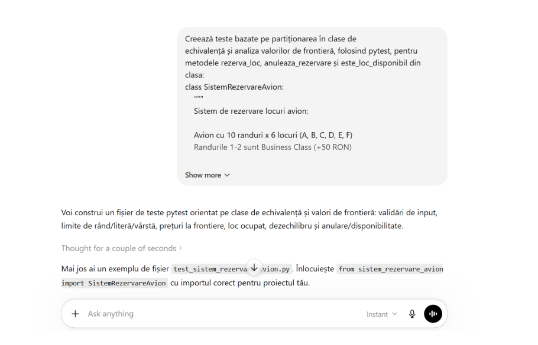
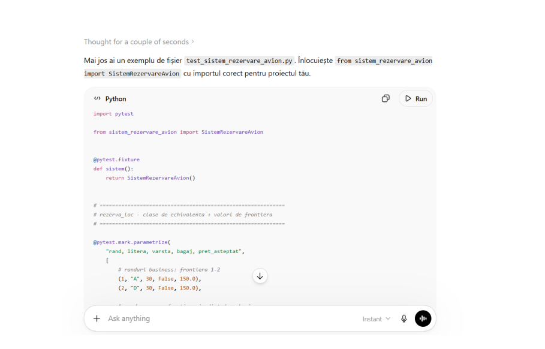
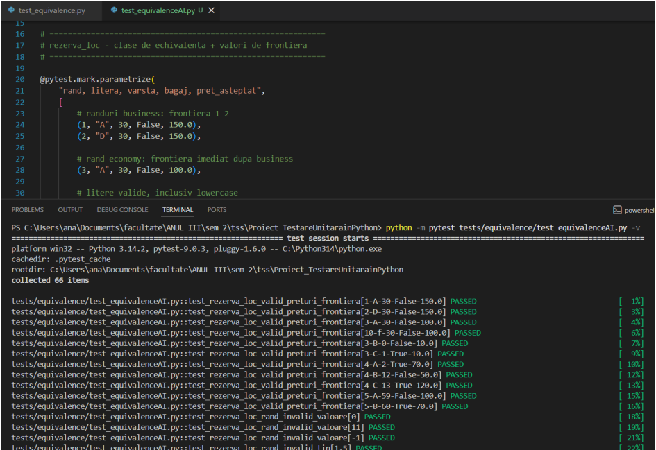
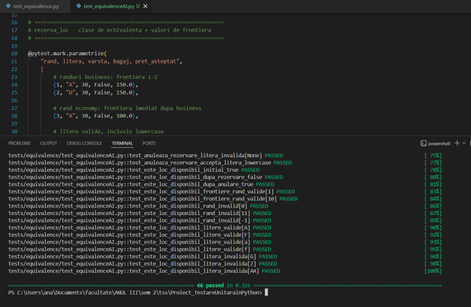
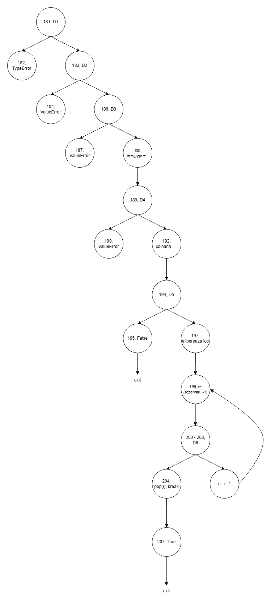
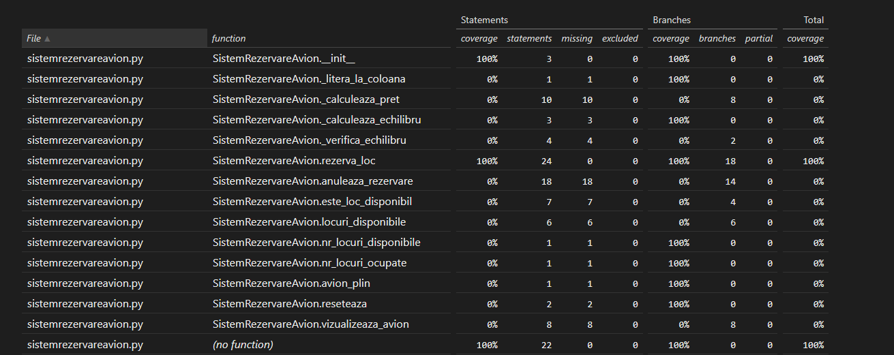

### Testare unitara in Python - Sistem de rezervare bilete avion 

- Cernea Ana (341)
- Grigorașcu Andrei-Antonio (351)
- Măciucă Emma-Iulia (341)
- Năvodaru Denisa-Ștefania (341)
- Nichita Iulia-Nicoleta (341)

### Introducere

Clasa `SistemRezervareAvion` este concepută pentru a gestiona procesul de rezervare a locurilor unui avion cu 10 rânduri, numerotate de la 1 la 10, 6 locuri pe rând, A-F, delimitate de un culoar. 

Prețul de bază al unui bilet este de 100 RON. Rândurile 1 și 2 aparțin clasei Business și rezervarea unui loc în această clasă presupune un adaos de 50 RON la prețul de bază. La efectuarea unei rezervări este necesară precizarea rândului, locului, vârstei, precum și adăugarea bagajului de cală sau nu. Datele determină valabilitatea locului și prețul biletului. Sistemul presupune reduceri de vârstă, precum și un adaos de 20 RON în cazul bagajului de cală. 


Reduceri varsta:

&#x20; - infant (< 2 ani):     90% reducere

&#x20; - copil (2-12 ani):     50% reducere

&#x20; - senior (>= 60 ani):   50% reducere

&#x20; - adult (13-59 ani):    fără reducere


Se ia în considerare diferența de locuri între partea stângă și partea dreaptă a avionului și este necesar să nu depășească valoarea de 3. În caz contrar, nu se poate realiza rezervarea ce ar realiza dezechilibru.


Pentru înregistrarea rezervărilor se utilizează variabilele locuri\_ocupate (tablou bidimensional de 10 rânduri și 6 coloane corespunzătoare locurilor avionului, unde locuri\_ocupate\[r]\[l]=True dacă locul de pe rândul r și coloana l este ocupat, False în caz contrar), pret\_baza, rezervari(listă de dicționare cu detalii).


Funcții ajutătoare:

* def \_litera\_la\_coloana(self, litera\_loc: str) -> int 

Converteste litera locului (A-F) la index coloana (0-5))


* def \_calculeaza\_pret(

&#x20;       self, rand: int, varsta\_pasager: int, are\_bagaj\_cala: bool

&#x20;   ) -> float

Calculează prețul final în funcție de clasă, vârstă, adăugarea bagaj cală.


* def \_calculeaza\_echilibru(self) -> tuple\[int, int]

Numară locurile ocupate pe fiecare parte a avionului utilizând variabila locuri\_ocupate și returnează un tuple\[int, int] - (nr\_ocupate\_stanga, nr\_ocupate\_dreapta)


* def \_verifica\_echilibru(self, coloana: int) -> bool

Verifică dacă adăugarea unui loc pe coloana dată ar depași pragul de dezechilibru MAX\_DEZECHILIBRU și returnează True - rezervarea este permisă, False - rezervarea ar depasi pragul de dezechilibru, prin utlizarea metodei \_calculeaza\_echilibru() și determinarea diferenței dintre valorile rezultate.


#### Funcționalitățile clasei:

* def rezerva\_loc(

&#x20;      self, rand: int, litera\_loc: str, varsta\_pasager: int, are\_bagaj\_cala: bool

&#x20;   )

Încearcă să rezerve locul (rand, litera\_loc) și returnează float - prețul final dacă rezervarea a reușit, "Ocupat" - dacă locul era deja rezervat, "Dezechilibru" - dacă rezervarea ar dezechilibra avionul peste pragul MAX\_DEZECHILIBRU. Raises: ValueError - dacă randul sau litera nu sunt valide, TypeError - dacă vârsta nu e int sau are\_bagaj\_cală nu e bool. Funcția utilizează locuri\_ocupate pentru a determina dacă locul este ocupat, \_calculeaza\_echilibru pentru a determina dacă locul este disponibil, iar ulterior locul respectiv este marcat ca True in locuri\_ocupate și sunt adăugate informațiile rezervării (rând, loc, vârstăm are\_bagaj, preț) în rezervări.


* def anuleaza\_rezervare(self, rand: int, litera\_loc: str) -> bool

Anuleaza rezervarea unui loc și returnează True - dacă locul era rezervat și a fost eliberat, False - dacă locul era deja liber. Raises: ValueError - dacă randul sau litera nu sunt valide. Funcția utilizează \_calculeaza\_echilibru pentru a determina dacă locul este deja liber, ulterior locul este marcat ca False în locuri\_libere și se șterge ultima înregistrare din rezervari ce corespunde locului specificat.


* def este\_loc\_disponibil(self, rand: int, litera\_loc: str) -> bool

Verifică daca un loc este disponibil (nerezervat). Returnează True - loc liber, False - loc ocupat. Raises: ValueError - dacă rândul sau litera nu sunt valide, utilizând variabila locuri\_ocupate.


* def locuri\_disponibile(self) -> list\[tuple\[int, str]]

Returnează lista tuturor locurilor libere ca tupluri (rand, litera) și returnează list\[tuple\[int, str]] - ex. \[(1, 'A'), (1, 'B'), ...], utilizând variabila locuri\_ocupate.


* def nr\_locuri\_disponibile(self) -> int

Returneaza numarul total de locuri libere, utilizând variabila locuri\_ocupate.


* def nr\_locuri\_ocupate(self) -> int

Returneaza numarul total de locuri ocupate, prin calcularea diferenței dintre numărul total de locuri ale avionului și nr\_locuri\_disponibile.


* def avion\_plin(self) -> bool

Returneaza True daca toate locurile sunt rezervate, prin apelarea metodei nr\_locuri\_ocupate().


* def reseteaza(self)

Elibereaza toate locurile si sterge istoricul rezervarilor prin eliberarea listei rezervari și a tabloului locuri\_ocupate.


* def vizualizeaza\_avion(self)

Vizualizeaza imaginea locurilor avionului (1 - loc ocupat, \_ - loc neocupat)


# Partiționarea în clase de echivalență și analiza valorilor de frontieră

## Framework

Pentru partiționarea în clase de echivalență și analiza valorilor de frontieră, am folosit framework-ul de testare **Pytest**.

Comandă de rulare a testelor:

```bash
python -m pytest tests/equivalence/test_equivalence.py -v
```

## Metode testate

Am testat toate cazurile corespunzătoare claselor de echivalență ale metodelor principale din clasa `SistemRezervareAvion`:

- `rezerva_loc`
- `anuleaza_rezervare`
- `este_loc_disponibil`

---

# 1. `rezerva_loc`

Pentru fiecare parametru al funcției:

```python
rezerva_loc(rand, litera_loc, varsta_pasager, are_bagaj_cala)
```

am creat următoarele clase de echivalență:

## Parametrul `rand` (int) - notat cu `r`

- `R_1 = {1, 2}`  => rând valid cu preț de Business Class

- `R_2 = 3…10`  => rând valid cu preț de Economy Class

- `R_3 = {r < 1 || r > 10}`  => rând invalid  => `ValueError`

- `R_4 = r este alt tip de date`  => rând invalid  => `TypeError`

- `R_5 = r este bool`  => rând invalid  => `TypeError`

### Analiza de frontieră pentru `rand`

#### `rand` valid

- limita inferioară: `r = 1`
- limita superioară: `r = 10`

#### `rand` invalid

- limita inferioară: `r = 0`
- limita superioară: `r = 11`

---

## Parametrul `litera_loc` (str) — notat cu `l`

- `L_1 = {'A', 'B', 'C', 'D', 'E', 'F'}`  => literă mare validă

- `L_2 = {'a', 'b', 'c', 'd', 'e', 'f'}`  => literă mică validă

- `L_3 = l este str, dar nu aparține intervalului A-F sau a-f`  => literă invalidă  => `ValueError`

- `L_4 = l este alt tip de date`  => literă invalidă  => `ValueError`

- `L_5 = l este str, dar are lungime diferită de 1`  => literă invalidă  => `ValueError`

### Analiza de frontieră pentru `litera_loc`

#### `litera_loc` valid

- limita inferioară: `l = 'A'` sau `l = 'a'`
- limita superioară: `l = 'F'` sau `l = 'f'`

#### `litera_loc` invalid

- limita superioară: `l = 'G'` sau `l = 'g'`

---

## Parametrul `varsta_pasager` (int) — notat cu `v`

- `V_1 = {0, 1}`  => vârstă validă pentru infant, preț redus 90%

- `V_2 = {2…12}`  => vârstă validă pentru copil, preț redus 50%

- `V_3 = {13…59}`  => vârstă validă pentru adult, preț întreg

- `V_4 = {v >= 60}`  => vârstă validă pentru senior, preț redus 50%

- `V_5 = {v < 0}`  => vârstă invalidă  => `ValueError`

- `V_6 = v este alt tip de date`  => vârstă invalidă  => `TypeError`

- `V_7 = v este bool`  => vârstă invalidă  => `TypeError`

### Analiza de frontieră pentru `varsta_pasager`

#### `varsta_pasager` valid pentru infant

- limita inferioară: `v = 0`
- limita superioară: `v = 1`

#### `varsta_pasager` valid pentru copil

- limita inferioară: `v = 2`
- limita superioară: `v = 12`

#### `varsta_pasager` valid pentru adult

- limita inferioară: `v = 13`
- limita superioară: `v = 59`

#### `varsta_pasager` valid pentru senior

- limita inferioară: `v = 60`

#### `varsta_pasager` invalid

- limita inferioară: `v = -1`

---

## Parametrul `are_bagaj_cala` (bool) — notat cu `b`

- `B_1 = b este True și pasagerul nu este infant`  => bagaj de cală inclus, se adaugă `20` la preț

- `B_2 = b este False`  => bagaj de cală neinclus, prețul nu se modifică

- `B_3 = b este True și pasagerul este infant`  => bagajul de cală nu modifică prețul

- `B_4 = b este alt tip de date`  => bagaj invalid  => `TypeError`

---

# 2. `anuleaza_rezervare`

Pentru fiecare parametru al funcției:

```python
anuleaza_rezervare(rand, litera_loc)
```

am creat următoarele clase de echivalență:

## Parametrul `rand`

- `R_1 = {1, 2}`  => rând valid de Business Class

- `R_2 = 3…10`  => rând valid de Economy Class

- `R_3 = {r < 1 || r > 10}`  => rând invalid  => `ValueError`

- `R_4 = r este alt tip de date`  => rând invalid  => `TypeError`

- `R_5 = r este bool`  => rând invalid  => `TypeError`

- `R_6 = r este valid, dar locul este deja liber`  => anularea returnează `False`

### Analiza de frontieră pentru `rand`

#### `rand` valid

- limita inferioară: `r = 1`
- limita superioară: `r = 10`

#### `rand` invalid

- limita inferioară: `r = 0`
- limita superioară: `r = 11`

## Parametrul `litera_loc`

Pentru `litera_loc` se folosesc aceleași clase de echivalență și aceleași valori de frontieră ca în metoda `rezerva_loc`.

---

# 3. `este_loc_disponibil`

Pentru fiecare parametru al funcției:

```python
este_loc_disponibil(rand, litera_loc)
```

am creat următoarele clase de echivalență:

## Parametrul `rand`

- `R_1 = r este valid și locul este liber`  
  => metoda returnează `True`

- `R_2 = r este valid și locul este ocupat`  
  => metoda returnează `False`

- `R_3 = {r < 1 || r > 10}`  
  => rând invalid  
  => `ValueError`

### Analiza de frontieră pentru `rand`

#### `rand` valid

- limita inferioară: `r = 1`
- limita superioară: `r = 10`

#### `rand` invalid

- limita inferioară: `r = 0`
- limita superioară: `r = 11`

## Parametrul `litera_loc`

Pentru `litera_loc` se folosesc aceleași clase de echivalență și aceleași valori de frontieră ca în metoda `rezerva_loc`.

---

# Raport AI

Am folosit **ChatGPT Plus** pentru a evidenția diferența dintre testele scrise manual și cele generate cu ajutorul unui tool AI.

## Prompt

> Creează teste bazate pe partiționarea în clase de echivalență și analiza valorilor de frontieră, folosind pytest, pentru metodele `rezerva_loc`, `anuleaza_rezervare` și `este_loc_disponibil` din clasa `SistemRezervareAvion`.

Am atașat și codul clasei în prompt.

## Răspuns

> Voi construi un fișier de teste pytest orientat pe clase de echivalență și valori de frontieră: validări de input, limite de rând/literă/vârstă, prețuri la frontiere, loc ocupat, dezechilibru și anulare/disponibilitate.
>
> Mai jos ai un exemplu de fișier test_sistem_rezervare_avion.py. Înlocuiește: from sistem_rezervare_avion import SistemRezervareAvion cu importul corect pentru proiectul tău.

Am copiat codul primit în răspuns și l-am introdus în proiect, în fișierul: `test_equivalenceAI.py`




Am rulat testele generate și au trecut toate.




Cu toate acestea, se poate observa că testele sunt create fără o ordine clară și nu acoperă toate cazurile. Eu am creat testele conform teoriei, împărțind datele de intrare pe cazurile corespunzătoare claselor de echivalență, iar apoi conform analizei de frontieră, evidențiind clar toate posibilitățile.

Testele generate de AI conțin și cazuri în plus, care țin de starea sistemului, datele de intrare fiind valide și verificate deja înainte.

Exemple:

```python
def test_rezerva_loc_ocupat(sistem):
    assert sistem.rezerva_loc(1, "A", 30, False) == 150.0
    assert sistem.rezerva_loc(1, "A", 30, False) == "Ocupat"


def test_rezerva_loc_refuzat_dezechilibru_stanga(sistem):
    assert sistem.rezerva_loc(1, "A", 30, False) == 150.0
    assert sistem.rezerva_loc(2, "A", 30, False) == 150.0
    assert sistem.rezerva_loc(3, "A", 30, False) == 100.0

    # A patra rezervare pe stanga ar duce diferenta la 4 > MAX_DEZECHILIBRU
    assert sistem.rezerva_loc(4, "A", 30, False) == "Dezechilibru"
```

De asemenea, mai multe cazuri lipsesc, cum ar fi verificarea cazului în care litera locului este mică și în afara intervalului, caz care ar declanșa `ValueError`, sau este de tip `True` sau `float`, caz care ar declanșa `TypeError`.


# Testare Structurală

# CFG + set minim teste structurale (S/B/C)

Pentru aceeași metodă, au fost construite seturi distincte de teste pentru statement coverage, branch coverage și condition coverage, astfel încât să se poată observa diferența dintre criterii și creșterea numărului minim de teste necesare. 
Testele suplimentare au fost separate de seturile minime, deoarece acestea nu sunt necesare pentru atingerea criteriului structural, ci pentru validarea mai clară a regulilor de business.

Legendă:
- S = acoperire la nivel de instrucțiune (statement)
- B = acoperire la nivel de ramură (branch)
- C = acoperire la nivel de condiție (condition)

Pentru metoda `rezerva_loc` a fost realizată și demonstrația pentru criteriul MC/DC, evidențiind modul în care fiecare condiție atomică dintr-o decizie influențează independent rezultatul acesteia.
Comenzi de rulare:


```bash
python -m pip install coverage pytest

python -m coverage erase
python -m coverage run --branch -m pytest test_coverage.py -v
python -m coverage html -d htmlcov
```

Pentru vizualizarea raportului, se deschide fișierul `htmlcov/index.html`

## 1) `__init__`

CFG:

```text
Start
 -> init locuri_ocupate
 -> init pret_baza
 -> init rezervari
Stop
```

Metoda `__init__` este liniară și nu conține decizii sau condiții compuse. Prin urmare, nu există ramuri alternative în fluxul de execuție.

Număr minim teoretic de teste:
- Statement coverage: 1
- Branch coverage: 1 (trivial, nu există ramuri)
- Condition coverage: 1 (trivial, nu există condiții)

Set minim de teste:
- I1: creare obiect și verificare stare inițială

## 2) `_litera_la_coloana`

CFG:

```text
Start
 -> litera_loc.upper()
 -> ord(...) - ord("A")
Stop
```

Număr minim teoretic de teste:
- Statement coverage: 1
- Branch coverage: 1
- Condition coverage: 1

Set minim de teste:
- L1: literă validă, de exemplu "A"

Teste suplimentare:
- L2: literă mică "f" pentru a verifica conversia upper() (nu este necesar structural)

## 3) `_calculeaza_pret`

CFG:

```text
Start
 -> pret = pret_baza
 -> D1: rand <= 2 ?
      True  -> pret += SUPLIMENT_BUSINESS
      False -> skip
 -> D2: varsta_pasager < 2 ?
      True  -> pret *= 0.1
      False -> D3
 -> D3: varsta_pasager <= 12 or varsta_pasager >= 60 ?
      True  -> pret *= 0.5
      False -> skip
 -> D4: are_bagaj_cala and varsta_pasager >= 2 ?
      True  -> pret += SUPLIMENT_BAGAJ
      False -> skip
 -> return round(float(pret), 2)
Stop
```

Metoda conține patru decizii:
- D1: rand <= 2
- D2: varsta_pasager < 2
- D3: varsta_pasager <= 12 or varsta_pasager >= 60
- D4: are_bagaj_cala and varsta_pasager >= 2

Dintre acestea:
- D1 și D2 sunt decizii simple;
- D3 și D4 sunt decizii compuse.

Analiză:

Metoda conține patru decizii: două simple și două compuse. În consecință, numărul minim de teste diferă în funcție de criteriul de acoperire.

Număr minim teoretic de teste:
- Statement coverage: 2
- Branch coverage: 3
- Condition coverage: 4

Set minim:
#### Statement coverage
- P1: (1, 1, False) → business + infant
- P2: (5, 10, True) → copil + bagaj

#### Branch coverage
- P1: (1, 1, False)
- P2: (5, 10, True)
- P3: (5, 30, False)

#### Condition coverage
- P1: (1, 1, False)
- P2: (5, 10, True)
- P3: (5, 30, False)
- P4: (5, 65, False)

#### Teste suplimentare
- P5: (5, 1, True) → infant cu bagaj; util pentru validarea explicită a regulii de business. Nu este necesar pentru minimul structural.

## 4) `_calculeaza_echilibru`

CFG:

```text
Start
 -> stanga = sum(... ocupat and col_idx < 3)
 -> dreapta = sum(... ocupat and col_idx >= 3)
 -> return (stanga, dreapta)
Stop
```

Set minim:

#### Statement coverage
- E1: avion gol

#### Branch coverage
- E1: avion gol
- E2: (1, "A"), (1, "D")

#### Pentru condition coverage
- E1: avion gol
- E2: (1, "A"), (1, "D")


## 5) `_verifica_echilibru`

CFG:

```text
Start
 -> (stanga, dreapta) = _calculeaza_echilibru()
 -> D1: coloana < 3 ?
      True  -> D2: (stanga + 1 - dreapta) <= MAX_DEZECHILIBRU ?
                  True  -> return True
                  False -> return False
      False -> D3: (dreapta + 1 - stanga) <= MAX_DEZECHILIBRU ?
                  True  -> return True
                  False -> return False
Stop
```

**Notă:** În cadrul acestui proiect, noțiunea de decizie este utilizată conform definiției din cursul 2 – Structural Testing (pagina 8), unde deciziile sunt asociate exclusiv structurilor de control ale fluxului de execuție, precum if, while și for. În consecință, evaluarea directă a unei expresii booleene (de exemplu într-o instrucțiune return expr) nu este clasificată ca decizie și nu introduce ramuri suplimentare în graful de control (CFG).

Număr minim teoretic de teste:
- Statement coverage: 2
- Branch coverage: 3
- Condition coverage: 3

Set minim:
#### Statement coverage
- V1: coloană pe stânga, permis
- V2: coloană pe dreapta, permis

#### Branch coverage
- V1: coloană pe stânga, permis
- V2: coloană pe dreapta, permis
- V3: coloană pe stânga, refuzat după 3 locuri pe stânga

#### Condition coverage
- V1: coloană pe stânga, permis
- V2: coloană pe dreapta, permis
- V3: coloană pe stânga, refuzat după 3 locuri pe stânga

Teste suplimentare:
- V4: coloană pe dreapta, refuzat după 3 locuri pe dreapta; util pentru verificarea simetriei, dar nenecesar pentru minimul structural.

## 6) `rezerva_loc`

```text
Start
 -> D1: not isinstance(rand, int) or isinstance(rand, bool) ?
      True  -> raise TypeError
      False -> D2
 -> D2: not (1 <= rand <= NR_RANDURI) ?
      True  -> raise ValueError
      False -> D3
 -> D3: not isinstance(litera_loc, str) or len(litera_loc) != 1 ?
      True  -> raise ValueError
      False -> litera_upper = litera_loc.upper()
 -> D4: litera_upper not in LITERE_VALIDE ?
      True  -> raise ValueError
      False -> D5
 -> D5: not isinstance(varsta_pasager, int) or isinstance(varsta_pasager, bool) ?
      True  -> raise TypeError
      False -> D6
 -> D6: varsta_pasager < 0 ?
      True  -> raise ValueError
      False -> D7
 -> D7: not isinstance(are_bagaj_cala, bool) ?
      True  -> raise TypeError
      False -> coloana = _litera_la_coloana(...)
 -> D8: locul este ocupat ?
      True  -> return "Ocupat"
      False -> D9
 -> D9: not _verifica_echilibru(coloana) ?
      True  -> return "Dezechilibru"
      False -> calculeaza pret
 -> locuri_ocupate[rand - 1][coloana] = True
 -> append in rezervari
 -> return pret_final
Stop
```


Număr minim teoretic de teste:
- Statement coverage: 10
- Branch coverage: 10
- Condition coverage: 14
- MC/DC coverage: 14

Set minim:
#### Statement coverage
- R1: tip invalid la rand
- R2: valoare invalidă la rand
- R3: format invalid la literă
- R4: literă invalidă
- R5: tip invalid la vârstă
- R6: vârstă negativă
- R7: tip invalid la bagaj
- R8: rezervare validă
- R9: loc ocupat
- R10: dezechilibru

#### Branch coverage
- R1: tip invalid la rand
- R2: valoare invalidă la rand
- R3: format invalid la literă
- R4: literă invalidă
- R5: tip invalid la vârstă
- R6: vârstă negativă
- R7: tip invalid la bagaj
- R8: rezervare validă
- R9: loc ocupat
- R10: dezechilibru

#### Condition coverage
- R1: rand="1"
- R2: rand=True
- R3: rand=0
- R4: rand=11
- R5: litera_loc=5
- R6: litera_loc="AB"
- R7: litera_loc="Z"
- R8: varsta_pasager="30"
- R9: varsta_pasager=True
- R10: varsta_pasager=-1
- R11: are_bagaj_cala="da"
- R12: rezervare validă
- R13: loc ocupat
- R14: dezechilibru

#### MC/DC coverage

MC/DC reprezintă o formă mai puternică de condition/decision coverage. Pe lângă faptul că fiecare condiție individuală trebuie să ia valorile True și False, trebuie demonstrat și că fiecare condiție poate influența independent rezultatul deciziei din care face parte.

## Decizii analizate

```text
D1: not isinstance(rand, int) or isinstance(rand, bool)
D2: not (1 <= rand <= NR_RANDURI)
D3: not isinstance(litera_loc, str) or len(litera_loc) != 1
D4: litera_upper not in LITERE_VALIDE
D5: not isinstance(varsta_pasager, int) or isinstance(varsta_pasager, bool)
D6: varsta_pasager < 0
D7: not isinstance(are_bagaj_cala, bool)
D8: self.locuri_ocupate[rand - 1][coloana]
D9: not self._verifica_echilibru(coloana)
```

Pentru deciziile compuse, condițiile individuale sunt:

```text
D1:
  C1 = not isinstance(rand, int)
  C2 = isinstance(rand, bool)

D2:
  C3 = rand < 1
  C4 = rand > NR_RANDURI

D3:
  C5 = not isinstance(litera_loc, str)
  C6 = len(litera_loc) != 1

D5:
  C7 = not isinstance(varsta_pasager, int)
  C8 = isinstance(varsta_pasager, bool)
```

Celelalte decizii sunt decizii simple. Pentru acestea este suficient ca decizia să fie evaluată o dată pe `True` și o dată pe `False`.

---

## Număr minim de teste

Numărul minim de teste necesare pentru MC/DC este:

```text
1 test valid de bază
+ 2 teste pentru D1
+ 2 teste pentru D2
+ 2 teste pentru D3
+ 1 test pentru D4
+ 2 teste pentru D5
+ 1 test pentru D6
+ 1 test pentru D7
+ 1 test pentru D8
+ 1 test pentru D9
= 14 teste
```

Observație: față de setul pentru condition coverage, nu este necesar un test suplimentar dacă testul `litera_loc=5` este înlocuit cu `litera_loc=["A"]`. Această modificare permite demonstrarea influenței independente a condiției `not isinstance(litera_loc, str)` în decizia D3. Astfel, condiția `len(litera_loc) != 1` este conceptual `False`, iar influența independentă a condiției `not isinstance(litera_loc, str)` poate fi demonstrată corect.


## Demonstrație MC/DC pentru deciziile compuse

### D1: `not isinstance(rand, int) or isinstance(rand, bool)`

| Test | C1: `not isinstance(rand, int)` | C2: `isinstance(rand, bool)` | D1 |
|---|---:|---:|---:|
| R1: `rand="1"` | True | False | True |
| R2: `rand=True` | False | True | True |
| R12: `rand=1` | False | False | False |

Perechi MC/DC:

- C1 este demonstrată prin R1 și R12: C2 rămâne `False`, iar D1 se schimbă din `True` în `False`.
- C2 este demonstrată prin R2 și R12: C1 rămâne `False`, iar D1 se schimbă din `True` în `False`.

---

### D2: `not (1 <= rand <= NR_RANDURI)`

Această decizie poate fi tratată echivalent ca:

```text
rand < 1 or rand > NR_RANDURI
```

| Test | C3: `rand < 1` | C4: `rand > NR_RANDURI` | D2 |
|---|---:|---:|---:|
| R3: `rand=0` | True | False | True |
| R4: `rand=11` | False | True | True |
| R12: `rand=1` | False | False | False |

Perechi MC/DC:

- C3 este demonstrată prin R3 și R12: C4 rămâne `False`, iar D2 se schimbă din `True` în `False`.
- C4 este demonstrată prin R4 și R12: C3 rămâne `False`, iar D2 se schimbă din `True` în `False`.

---

### D3: `not isinstance(litera_loc, str) or len(litera_loc) != 1`

| Test | C5: `not isinstance(litera_loc, str)` | C6: `len(litera_loc) != 1` | D3 |
|---|---:|---:|---:|
| R5: `litera_loc=["A"]` | True | False | True |
| R6: `litera_loc="AB"` | False | True | True |
| R12: `litera_loc="A"` | False | False | False |

Perechi MC/DC:

- C5 este demonstrată prin R5 și R12: C6 rămâne `False`, iar D3 se schimbă din `True` în `False`.
- C6 este demonstrată prin R6 și R12: C5 rămâne `False`, iar D3 se schimbă din `True` în `False`.

---

### D5: `not isinstance(varsta_pasager, int) or isinstance(varsta_pasager, bool)`

| Test | C7: `not isinstance(varsta_pasager, int)` | C8: `isinstance(varsta_pasager, bool)` | D5 |
|---|---:|---:|---:|
| R8: `varsta_pasager="30"` | True | False | True |
| R9: `varsta_pasager=True` | False | True | True |
| R12: `varsta_pasager=30` | False | False | False |

Perechi MC/DC:

- C7 este demonstrată prin R8 și R12: C8 rămâne `False`, iar D5 se schimbă din `True` în `False`.
- C8 este demonstrată prin R9 și R12: C7 rămâne `False`, iar D5 se schimbă din `True` în `False`.

---

## Demonstrație pentru deciziile simple

Pentru deciziile simple este suficient ca decizia să fie evaluată o dată pe `True` și o dată pe `False`.

| Decizie | True | False |
|---|---|---|
| D4: `litera_upper not in LITERE_VALIDE` | R7 | R12 |
| D6: `varsta_pasager < 0` | R10 | R12 |
| D7: `not isinstance(are_bagaj_cala, bool)` | R11 | R12 |
| D8: `self.locuri_ocupate[rand - 1][coloana]` | R13 | R12 |
| D9: `not self._verifica_echilibru(coloana)` | R14 | R12 |

---


#### Set minim selectat
- R1: rand="1"
- R2: rand=True
- R3: rand=0
- R4: rand=11
- R5: litera_loc=["A"]
- R6: litera_loc="AB"
- R7: litera_loc="Z"
- R8: varsta_pasager="30"
- R9: varsta_pasager=True
- R10: varsta_pasager=-1
- R11: are_bagaj_cala="da"
- R12: rezervare validă
- R13: loc ocupat
- R14: dezechilibru

## 7) `anuleaza_rezervare`

CFG:

```text
Start
 -> D1: not isinstance(rand, int) or isinstance(rand, bool) ?
      True  -> raise TypeError
      False -> D2
 -> D2: not (1 <= rand <= NR_RANDURI) ?
      True  -> raise ValueError
      False -> D3
 -> D3: not isinstance(litera_loc, str) or len(litera_loc) != 1 ?
      True  -> raise ValueError
      False -> litera_upper = litera_loc.upper()
 -> D4: litera_upper not in LITERE_VALIDE ?
      True  -> raise ValueError
      False -> coloana = _litera_la_coloana(...)
 -> D5: not self.locuri_ocupate[rand - 1][coloana] ?
      True  -> return False
      False -> elibereaza locul
 -> for i = len(rezervari)-1 ... 0
      -> D6: rezervari[i]["rand"] == rand and rezervari[i]["loc"] == litera_upper ?
           True  -> pop(i), break
           False -> continua bucla
 -> return True
Stop
```



Număr minim teoretic de teste:
- Statement coverage: 6
- Branch coverage: 8
- Condition coverage: 11

Set minim

#### Statement coverage
- A1: tip invalid la rand
- A2: valoare invalidă la rand
- A3: format invalid la literă
- A4: literă invalidă
- A5: loc deja liber
- A6: anulare reușită

#### Branch coverage
- A1: tip invalid la rand
- A2: valoare invalidă la rand
- A3: format invalid la literă
- A4: literă invalidă
- A5: loc deja liber
- A6: anulare reușită
- A10: loc ocupat, dar prima rezervare verificată în istoric nu corespunde; bucla continuă și apoi găsește rezervarea corectă
- A11: loc marcat ca ocupat, dar fără rezervare în istoric; bucla se termină fără break, apoi funcția returnează True

#### Condition coverage
- A1: rand="1"
- A2: rand=True
- A3: rand=0
- A4: rand=11
- A5: litera_loc=5
- A6: litera_loc="AB"
- A7: litera_loc="Z"
- A8: loc valid, deja liber
- A9: loc valid și rezervat
`Acoperă ramura False pentru condiția not self.locuri_ocupate[rand - 1][coloana].`
- A10: rezervarea căutată nu este ultima din istoric
`Acoperă ramura False a condiției compuse din buclă: rezervari[i]["rand"] == rand and rezervari[i]["loc"] == litera_upper.`
- A11: loc ocupat fără rezervare în istoric
`Acoperă ieșirea din bucla for fără găsirea unei rezervări corespunzătoare.`

## 8) `este_loc_disponibil`

CFG:

```text
Start
 -> D1: not (1 <= rand <= NR_RANDURI) ?
      True  -> raise ValueError
      False -> litera_upper = litera_loc.upper()
 -> D2: litera_upper not in LITERE_VALIDE ?
      True  -> raise ValueError
      False -> coloana = _litera_la_coloana(litera_upper)
 -> return not self.locuri_ocupate[rand - 1][coloana]
Stop
```

Număr minim teoretic de teste:
- Statement coverage: 3
- Branch coverage: 4
- Condition coverage: 4

Set minim:

#### Statement coverage
- E1: rand invalid
- E2: litera_loc invalidă
- E3: loc valid, liber

#### Branch coverage
- E1: rand invalid
- E2: litera_loc invalidă
- E3: loc valid, liber

#### Condition coverage
- E1: rand=0
- E2: litera_loc="Z"
- E3: loc liber

Teste suplimentare:
- E4: loc valid, ocupat
- E5: literă mică ("a"), utilă funcțional, dar nenecesară pentru minimul structural.

## 9) `locuri_disponibile`

CFG:

```text
Start
 -> libere = []
 -> for rand_idx in range(NR_RANDURI):
      -> for col_idx in range(NR_COLOANE):
           -> D1: not self.locuri_ocupate[rand_idx][col_idx] ?
                True  -> libere.append((rand_idx + 1, LITERE_VALIDE[col_idx]))
                False -> skip
 -> return libere
Stop
```

Număr minim teoretic de teste:
- Statement coverage: 1
- Branch coverage: 2
- Condition coverage: 2

Set minim:

#### Statement coverage
- LD1: avion gol → toate locurile sunt libere

#### Branch coverage
- LD1: avion gol → se execută ramura True
- LD2: există cel puțin un loc ocupat → se execută și ramura False

#### Condition coverage
- LD1: loc liber
- LD2: loc ocupat

Teste suplimentare:
- LD3: avion parțial ocupat și verificarea exactă a listei rezultate; util pentru validarea ordinii de parcurgere și a conținutului exact al rezultatului, dar nenecesar pentru minimul structural.
- LD4: avion complet ocupat; util pentru a verifica faptul că metoda returnează lista goală [], deși acest caz nu este cerut pentru minimul structural.

## 10) `nr_locuri_disponibile`

CFG:

```text
Start
 -> return sum(1 for rand in self.locuri_ocupate
                 for ocupat in rand
                 if not ocupat)
Stop
```

Număr minim teoretic de teste:

- Statement coverage: 1
- Branch coverage: 2
- Condition coverage: 2

#### Statement coverage
- NLD1: avion gol → toate locurile sunt libere

#### Branch coverage
- NLD1: avion gol → condiția not ocupat este evaluată pe True
- NLD2: există cel puțin un loc ocupat → condiția este evaluată și pe False

#### Condition coverage
- NLD1: loc liber
- NLD2: loc ocupat

Teste suplimentare:

- NLD3: avion parțial ocupat și verificarea numărului exact de locuri rămase;


## 11) `nr_locuri_ocupate`

CFG:

```text
Start
 -> total_locuri = NR_RANDURI * NR_COLOANE
 -> locuri_libere = nr_locuri_disponibile()
 -> return total_locuri - locuri_libere
Stop
```

Număr minim teoretic de teste:

- Statement coverage: 1
- Branch coverage: 1
- Condition coverage: 1

#### Statement coverage
- NLO1: avion gol → numărul de locuri ocupate este 0

#### Branch coverage
- NLO1: avion gol

#### Condition coverage
- NLO1: avion gol

Teste suplimentare:

- NLO2: avion parțial ocupat și verificarea numărului exact de locuri ocupate;
- NLO3: avion complet ocupat și verificarea rezultatului 60.

## 12) `avion_plin`

CFG:

```text
Start
Start
 -> return nr_locuri_disponibile() == 0
Stop
```

Număr minim teoretic de teste:

- Statement coverage: 1
- Branch coverage: 0 (nu există decizii)
- Condition coverage: 0 (nu există condiții în sensul cursului)

Set minim:

#### Statement coverage
- AP1: avion plin → rezultatul este True

#### Branch coverage
- AP1: avion plin → condiția este evaluată pe True

#### Condition coverage
- AP1: avion plin → condiția este evaluată pe True

Teste suplimentare:
- AP2: avion neplin → condiția este evaluată pe False

## 13) `reseteaza`

CFG:

```text
Start
 -> self.locuri_ocupate = [[False] * NR_COLOANE for _ in range(NR_RANDURI)]
 -> self.rezervari.clear()
Stop
```

Număr minim teoretic de teste:

- Statement coverage: 1
- Branch coverage: 1
- Condition coverage: 1

#### Statement coverage
- RST1: avion cu locuri ocupate și rezervări existente, apoi apel `reseteaza`

#### Branch coverage
- RST1: avion cu stare modificată, apoi apel reseteaza

#### Condition coverage
- RST1: avion cu stare modificată, apoi apel reseteaza

## 14) `vizualizeaza_avion`

CFG :

```text
Start
 -> for rand_idx in range(NR_RANDURI):
      -> for col_idx in range(NR_COLOANE):
           -> D1: col_idx == 3 ?
                True  -> print(" ", end="")
                False -> skip
           -> D2: self.locuri_ocupate[rand_idx][col_idx] ?
                True  -> print(1, end="")
                False -> print("_", end="")
      -> print()
Stop
```

Număr minim teoretic de teste:

- Statement coverage: 1
- Branch coverage: 1
- Condition coverage: 1

#### Statement coverage
- VIZ1: există cel puțin un loc ocupat și cel puțin un loc liber

#### Branch coverage
- VIZ1: există cel puțin un loc ocupat și cel puțin un loc liber

#### Condition coverage
- VIZ1: self.locuri_ocupate[rand_idx][col_idx] evaluată pe True și False

## Concluzie despre suficiență

Pentru acest proiect:
- setul marcat S/B/C este suficient pentru acoperire structurală 100% pe codul sursă;
- acoperirea structurală nu garantează absența defectelor de specificație;


Raport AI:

Am folosit **Gemini 3.1 Pro** pentru a evidenția diferența dintre testele scrise manual și cele generate cu ajutorul unui tool AI.

Prompt:

> Vreau să generezi o suită de teste unitare pentru metoda `rezerva_loc` de mai jos. 
> Scopul este să obții acoperire pentru:
>
> 1. Statement coverage
> 2. Branch coverage
> 3. Condition coverage
> 
> Metoda analizată este:
>```python
> def rezerva_loc(
>         self, rand: int, litera_loc: str, varsta_pasager: int, are_bagaj_cala: bool
>     ):
>        """
>         Incearca sa rezerve locul (rand, litera_loc)
> 
>         Returneaza:
>             float  - pretul final daca rezervarea a reusit
>             "Ocupat" - daca locul era deja rezervat
>             "Dezechilibru" - daca rezervarea ar dezechilibra avionul peste pragul MAX_DEZECHILIBRU
> 
>         Raises:
>             ValueError - daca randul sau litera nu sunt valide
>             TypeError  - daca varsta nu e int sau bool-ul nu e bool
>         """
>         # validare rand
>         if not isinstance(rand, int) or isinstance(rand, bool):
>             raise TypeError("Randul trebuie sa fie un numar intreg")
>         if not (1 <= rand <= self.NR_RANDURI):
>             raise ValueError(
>                 f"Rand invalid: {rand}. Trebuie sa fie intre 1 si {self.NR_RANDURI}"
>             )
> 
>         # validare litera loc
>         if not isinstance(litera_loc, str) or len(litera_loc) != 1:
>             raise ValueError("Litera locului trebuie sa fie un singur caracter (A-F)")
>         litera_upper = litera_loc.upper()
>         if litera_upper not in self.LITERE_VALIDE:
>             raise ValueError(f"Loc invalid: '{litera_loc}'. Trebuie sa fie una din A-F")
> 
>         # validare varsta
>         if not isinstance(varsta_pasager, int) or isinstance(varsta_pasager, bool):
>             raise TypeError("Varsta trebuie sa fie un numar intreg")
>         if varsta_pasager < 0:
>             raise ValueError("Varsta nu poate fi negativa")
> 
>         # validare bagaj
>         if not isinstance(are_bagaj_cala, bool):
>             raise TypeError("are_bagaj_cala trebuie sa fie True sau False")
> 
>         coloana = self._litera_la_coloana(litera_upper)
> 
>         # verificare disponibilitate
>         if self.locuri_ocupate[rand - 1][coloana]:
>             return "Ocupat"
> 
>         # verificare echilibru lateral
>         if not self._verifica_echilibru(coloana):
>             return "Dezechilibru"
> 
>         # calculare pret si efectuare rezervare
>         pret_final = self._calculeaza_pret(rand, varsta_pasager, are_bagaj_cala)
>         self.locuri_ocupate[rand - 1][coloana] = True
> 
>         self.rezervari.append(
>             {
>                 "rand": rand,
>                 "loc": litera_upper,
>                 "varsta": varsta_pasager,
>                 "bagaj_cala": are_bagaj_cala,
>                 "pret": pret_final,
>             }
>         )
> 
>         return pret_final
> ```
> Clasa din care face parte metoda este `SistemRezervareAvion`
> 
>     LITERE_VALIDE = list("ABCDEF")
>     NR_RANDURI = 10
>     NR_COLOANE = 6
>     PRET_BAZA = 100.0
>     SUPLIMENT_BUSINESS = 50.0
>     SUPLIMENT_BAGAJ = 20.0
>     MAX_DEZECHILIBRU = 3  # diferenta maxima admisa stanga vs dreapta
> 
>     def __init__(self):
>         # False = liber, True = ocupat
>         self.locuri_ocupate = [
>             [False] * self.NR_COLOANE for _ in range(self.NR_RANDURI)
>         ]
>         self.pret_baza = self.PRET_BAZA
>         # istoric rezervari: lista de dict-uri cu detalii
>         self.rezervari = []
> 
> Cerințe pentru răspuns:
> 
> 1. Analizează metoda rezerva_loc și identifică toate deciziile if.
> 2. Pentru fiecare decizie, identifică:
>    - condiția completă;
>    - subcondițiile atomice, acolo unde există expresii compuse cu or sau and;
>    - ramura True;
>    - ramura False;
>    - efectul executării ramurii.
> 3. Generează o suită minimă, dar suficientă, de teste pentru:
>    - statement coverage;
>    - branch coverage;
>    - condition coverage.
> 4. Testele trebuie redactate în Python, folosind unittest`.
>


Rezultate:

