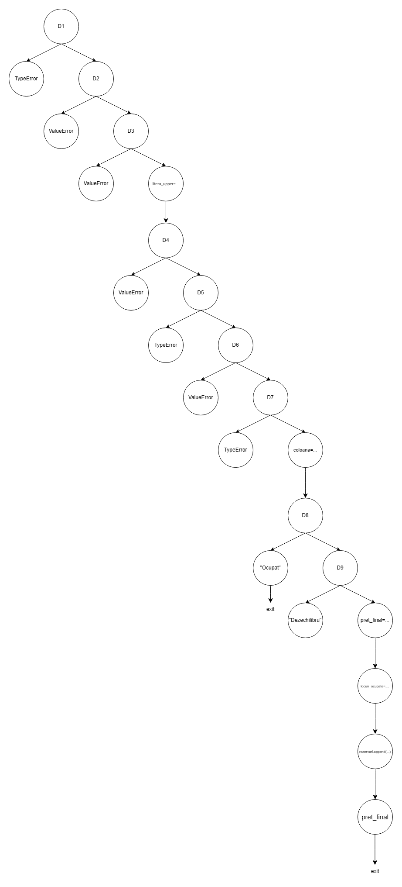
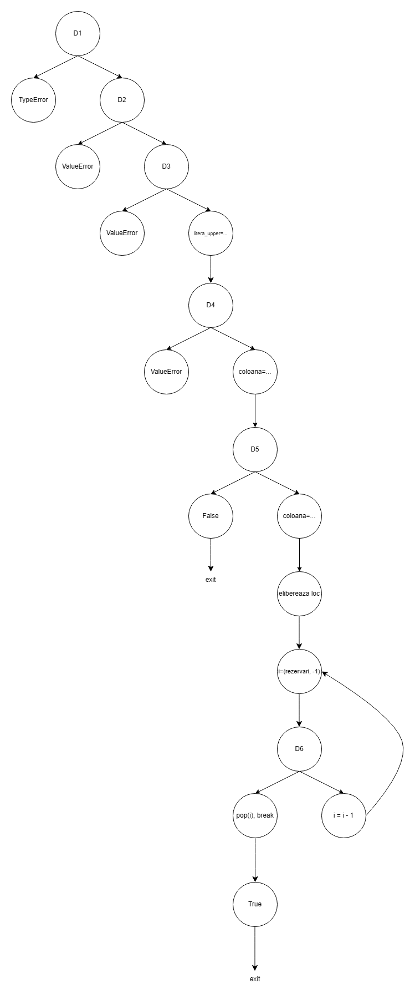

# CFG + set minim teste structurale (S/B/C)

TODO: Diagrame

Pentru aceeași metodă, au fost construite seturi distincte de teste pentru statement coverage, branch coverage și condition coverage, astfel încât să se poată observa diferența dintre criterii și creșterea numărului minim de teste necesare. 
Testele suplimentare au fost separate de seturile minime, deoarece acestea nu sunt necesare pentru atingerea criteriului structural, ci pentru validarea mai clară a regulilor de business.

Legendă:
- S = acoperire la nivel de instrucțiune (statement)
- B = acoperire la nivel de ramură (branch)
- C = acoperire la nivel de condiție (condition)

Comenzi de rulare:
```bash
python -m pip install coverage

python -m coverage run -m unittest -v test_coverage.py
python -m coverage report -m

python -m coverage html
```

## 1) `__init__`

CFG:

```text
Start
 -> init locuri_ocupate
 -> init pret_baza
 -> init rezervari
Stop
```

Metoda `__init__` este liniară și nu conține decizii sau condiții compuse. Prin urmare, nu există ramuri alternative în fluxul de execuție.

Număr minim teoretic de teste:
- Statement coverage: 1
- Branch coverage: 1 (trivial, nu există ramuri)
- Condition coverage: 1 (trivial, nu există condiții)

Set minim de teste:
- I1: creare obiect și verificare stare inițială

## 2) `_litera_la_coloana`

CFG:

```text
Start
 -> litera_loc.upper()
 -> ord(...) - ord("A")
Stop
```

Număr minim teoretic de teste:
- Statement coverage: 1
- Branch coverage: 1
- Condition coverage: 1

Set minim de teste:
- L1: literă validă, de exemplu "A"

Teste suplimentare:
- L2: literă mică "f" pentru a verifica conversia upper() (nu este necesar structural)

## 3) `_calculeaza_pret`

CFG:

```text
Start
 -> pret = pret_baza
 -> D1: rand <= 2 ?
      True  -> pret += SUPLIMENT_BUSINESS
      False -> skip
 -> D2: varsta_pasager < 2 ?
      True  -> pret *= 0.1
      False -> D3
 -> D3: varsta_pasager <= 12 or varsta_pasager >= 60 ?
      True  -> pret *= 0.5
      False -> skip
 -> D4: are_bagaj_cala and varsta_pasager >= 2 ?
      True  -> pret += SUPLIMENT_BAGAJ
      False -> skip
 -> return round(float(pret), 2)
Stop
```

Metoda conține patru decizii:
- D1: rand <= 2
- D2: varsta_pasager < 2
- D3: varsta_pasager <= 12 or varsta_pasager >= 60
- D4: are_bagaj_cala and varsta_pasager >= 2

Dintre acestea:
- D1 și D2 sunt decizii simple;
- D3 și D4 sunt decizii compuse.

Analiză:

Metoda conține patru decizii: două simple și două compuse. În consecință, numărul minim de teste diferă în funcție de criteriul de acoperire.

Număr minim teoretic de teste:
- Statement coverage: 2
- Branch coverage: 3
- Condition coverage: 4

Set minim:
#### Statement coverage
- P1: (1, 1, False) → business + infant
- P2: (5, 10, True) → copil + bagaj

#### Branch coverage
- P1: (1, 1, False)
- P2: (5, 10, True)
- P3: (5, 30, False)

#### Condition coverage
- P1: (1, 1, False)
- P2: (5, 10, True)
- P3: (5, 30, False)
- P4: (5, 65, False)

#### Teste suplimentare
- P5: (5, 1, True) → infant cu bagaj; util pentru validarea explicită a regulii de business. Nu este necesar pentru minimul structural.

## 4) `_calculeaza_echilibru`

CFG:

```text
Start
 -> stanga = sum(... ocupat and col_idx < 3)
 -> dreapta = sum(... ocupat and col_idx >= 3)
 -> return (stanga, dreapta)
Stop
```

Set minim:

#### Statement coverage
- E1: avion gol

#### Branch coverage
- E1: avion gol
- E2: (1, "A"), (1, "D")

#### Pentru condition coverage
- E1: avion gol
- E2: (1, "A"), (1, "D")


## 5) `_verifica_echilibru`

CFG:

```text
Start
 -> (stanga, dreapta) = _calculeaza_echilibru()
 -> D1: coloana < 3 ?
      True  -> D2: (stanga + 1 - dreapta) <= MAX_DEZECHILIBRU ?
                  True  -> return True
                  False -> return False
      False -> D3: (dreapta + 1 - stanga) <= MAX_DEZECHILIBRU ?
                  True  -> return True
                  False -> return False
Stop
```

**Notă:** În cadrul acestui proiect, noțiunea de decizie este utilizată conform definiției din cursul 2 – Structural Testing (pagina 8), unde deciziile sunt asociate exclusiv structurilor de control ale fluxului de execuție, precum if, while și for. În consecință, evaluarea directă a unei expresii booleene (de exemplu într-o instrucțiune return expr) nu este clasificată ca decizie și nu introduce ramuri suplimentare în graful de control (CFG).

Număr minim teoretic de teste:
- Statement coverage: 2
- Branch coverage: 3
- Condition coverage: 3

Set minim:
#### Statement coverage
- V1: coloană pe stânga, permis
- V2: coloană pe dreapta, permis

#### Branch coverage
- V1: coloană pe stânga, permis
- V2: coloană pe dreapta, permis
- V3: coloană pe stânga, refuzat după 3 locuri pe stânga

#### Condition coverage
- V1: coloană pe stânga, permis
- V2: coloană pe dreapta, permis
- V3: coloană pe stânga, refuzat după 3 locuri pe stânga

Teste suplimentare:
- V4: coloană pe dreapta, refuzat după 3 locuri pe dreapta; util pentru verificarea simetriei, dar nenecesar pentru minimul structural.

## 6) `rezerva_loc`

CFG: TODO: Diagrama draw.io

```text
Start
 -> D1: not isinstance(rand, int) or isinstance(rand, bool) ?
      True  -> raise TypeError
      False -> D2
 -> D2: not (1 <= rand <= NR_RANDURI) ?
      True  -> raise ValueError
      False -> D3
 -> D3: not isinstance(litera_loc, str) or len(litera_loc) != 1 ?
      True  -> raise ValueError
      False -> litera_upper = litera_loc.upper()
 -> D4: litera_upper not in LITERE_VALIDE ?
      True  -> raise ValueError
      False -> D5
 -> D5: not isinstance(varsta_pasager, int) or isinstance(varsta_pasager, bool) ?
      True  -> raise TypeError
      False -> D6
 -> D6: varsta_pasager < 0 ?
      True  -> raise ValueError
      False -> D7
 -> D7: not isinstance(are_bagaj_cala, bool) ?
      True  -> raise TypeError
      False -> coloana = _litera_la_coloana(...)
 -> D8: locul este ocupat ?
      True  -> return "Ocupat"
      False -> D9
 -> D9: not _verifica_echilibru(coloana) ?
      True  -> return "Dezechilibru"
      False -> calculeaza pret
 -> locuri_ocupate[rand - 1][coloana] = True
 -> append in rezervari
 -> return pret_final
Stop
```



Număr minim teoretic de teste:
- Statement coverage: 10
- Branch coverage: 10
- Condition coverage: 14

Set minim:
#### Statement coverage
- R1: tip invalid la rand
- R2: valoare invalidă la rand
- R3: format invalid la literă
- R4: literă invalidă
- R5: tip invalid la vârstă
- R6: vârstă negativă
- R7: tip invalid la bagaj
- R8: rezervare validă
- R9: loc ocupat
- R10: dezechilibru

#### Branch coverage
- R1: tip invalid la rand
- R2: valoare invalidă la rand
- R3: format invalid la literă
- R4: literă invalidă
- R5: tip invalid la vârstă
- R6: vârstă negativă
- R7: tip invalid la bagaj
- R8: rezervare validă
- R9: loc ocupat
- R10: dezechilibru

#### Condition coverage
- R1: rand="1"
- R2: rand=True
- R3: rand=0
- R4: rand=11
- R5: litera_loc=5
- R6: litera_loc="AB"
- R7: litera_loc="Z"
- R8: varsta_pasager="30"
- R9: varsta_pasager=True
- R10: varsta_pasager=-1
- R11: are_bagaj_cala="da"
- R12: rezervare validă
- R13: loc ocupat
- R14: dezechilibru

Teste suplimentare:
- verificarea conținutului din rezervari după rezervare reușită; utilă funcțional, dar nenecesară pentru minimul structural.

## 7) `anuleaza_rezervare`

CFG:

```text
Start
 -> D1: not isinstance(rand, int) or isinstance(rand, bool) ?
      True  -> raise TypeError
      False -> D2
 -> D2: not (1 <= rand <= NR_RANDURI) ?
      True  -> raise ValueError
      False -> D3
 -> D3: not isinstance(litera_loc, str) or len(litera_loc) != 1 ?
      True  -> raise ValueError
      False -> litera_upper = litera_loc.upper()
 -> D4: litera_upper not in LITERE_VALIDE ?
      True  -> raise ValueError
      False -> coloana = _litera_la_coloana(...)
 -> D5: not self.locuri_ocupate[rand - 1][coloana] ?
      True  -> return False
      False -> elibereaza locul
 -> for i = len(rezervari)-1 ... 0
      -> D6: rezervari[i]["rand"] == rand and rezervari[i]["loc"] == litera_upper ?
           True  -> pop(i), break
           False -> continua bucla
 -> return True
Stop
```



Număr minim teoretic de teste:
- Statement coverage: 6
- Branch coverage: 6
- Condition coverage: 8

Set minim

#### Statement coverage
- A1: tip invalid la rand
- A2: valoare invalidă la rand
- A3: format invalid la literă
- A4: literă invalidă
- A5: loc deja liber
- A6: anulare reușită

#### Branch coverage
- A1: tip invalid la rand
- A2: valoare invalidă la rand
- A3: format invalid la literă
- A4: literă invalidă
- A5: loc deja liber
- A6: anulare reușită

#### Condition coverage
- A1: rand="1"
- A2: rand=True
- A3: rand=0
- A4: rand=11
- A5: litera_loc=5
- A6: litera_loc="AB"
- A7: litera_loc="Z"
- A8: loc valid, deja liber / respectiv rezervat

## 8) `este_loc_disponibil`

CFG:

```text
Start
 -> D1: not (1 <= rand <= NR_RANDURI) ?
      True  -> raise ValueError
      False -> litera_upper = litera_loc.upper()
 -> D2: litera_upper not in LITERE_VALIDE ?
      True  -> raise ValueError
      False -> coloana = _litera_la_coloana(litera_upper)
 -> return not self.locuri_ocupate[rand - 1][coloana]
Stop
```

Număr minim teoretic de teste:
- Statement coverage: 3
- Branch coverage: 4
- Condition coverage: 4

Set minim:

#### Statement coverage
- E1: rand invalid
- E2: litera_loc invalidă
- E3: loc valid, liber

#### Branch coverage
- E1: rand invalid
- E2: litera_loc invalidă
- E3: loc valid, liber

#### Condition coverage
- E1: rand=0
- E2: litera_loc="Z"
- E3: loc liber

Teste suplimentare:
- E4: loc valid, ocupat
- E5: literă mică ("a"), utilă funcțional, dar nenecesară pentru minimul structural.

## 9) `locuri_disponibile`

CFG:

```text
Start
 -> libere = []
 -> for rand_idx in range(NR_RANDURI):
      -> for col_idx in range(NR_COLOANE):
           -> D1: not self.locuri_ocupate[rand_idx][col_idx] ?
                True  -> libere.append((rand_idx + 1, LITERE_VALIDE[col_idx]))
                False -> skip
 -> return libere
Stop
```

Număr minim teoretic de teste:
- Statement coverage: 1
- Branch coverage: 2
- Condition coverage: 2

Set minim:

#### Statement coverage
- LD1: avion gol → toate locurile sunt libere

#### Branch coverage
- LD1: avion gol → se execută ramura True
- LD2: există cel puțin un loc ocupat → se execută și ramura False

#### Condition coverage
- LD1: loc liber
- LD2: loc ocupat

Teste suplimentare:
- LD3: avion parțial ocupat și verificarea exactă a listei rezultate; util pentru validarea ordinii de parcurgere și a conținutului exact al rezultatului, dar nenecesar pentru minimul structural.
- LD4: avion complet ocupat; util pentru a verifica faptul că metoda returnează lista goală [], deși acest caz nu este cerut pentru minimul structural.

## 10) `nr_locuri_disponibile`

CFG:

```text
Start
 -> return sum(1 for rand in self.locuri_ocupate
                 for ocupat in rand
                 if not ocupat)
Stop
```

Număr minim teoretic de teste:

- Statement coverage: 1
- Branch coverage: 2
- Condition coverage: 2

#### Statement coverage
- NLD1: avion gol → toate locurile sunt libere

#### Branch coverage
- NLD1: avion gol → condiția not ocupat este evaluată pe True
- NLD2: există cel puțin un loc ocupat → condiția este evaluată și pe False

#### Condition coverage
- NLD1: loc liber
- NLD2: loc ocupat

Teste suplimentare:

- NLD3: avion parțial ocupat și verificarea numărului exact de locuri rămase;


## 11) `nr_locuri_ocupate`

CFG:

```text
Start
 -> total_locuri = NR_RANDURI * NR_COLOANE
 -> locuri_libere = nr_locuri_disponibile()
 -> return total_locuri - locuri_libere
Stop
```

Număr minim teoretic de teste:

- Statement coverage: 1
- Branch coverage: 1
- Condition coverage: 1

#### Statement coverage
- NLO1: avion gol → numărul de locuri ocupate este 0

#### Branch coverage
- NLO1: avion gol

#### Condition coverage
- NLO1: avion gol

Teste suplimentare:

- NLO2: avion parțial ocupat și verificarea numărului exact de locuri ocupate;
- NLO3: avion complet ocupat și verificarea rezultatului 60.

## 12) `avion_plin`

CFG:

```text
Start
Start
 -> return nr_locuri_disponibile() == 0
Stop
```

Număr minim teoretic de teste:

- Statement coverage: 1
- Branch coverage: 0 (nu există decizii)
- Condition coverage: 0 (nu există condiții în sensul cursului)

Set minim:

#### Statement coverage
- AP1: avion plin → rezultatul este True

#### Branch coverage
- AP1: avion plin → condiția este evaluată pe True

#### Condition coverage
- AP1: avion plin → condiția este evaluată pe True

Teste suplimentare:
- AP2: avion neplin → condiția este evaluată pe False

## 13) `reseteaza`

CFG:

```text
Start
 -> self.locuri_ocupate = [[False] * NR_COLOANE for _ in range(NR_RANDURI)]
 -> self.rezervari.clear()
Stop
```

Număr minim teoretic de teste:

- Statement coverage: 1
- Branch coverage: 1
- Condition coverage: 1

#### Statement coverage
- RST1: avion cu locuri ocupate și rezervări existente, apoi apel `reseteaza`

#### Branch coverage
- RST1: avion cu stare modificată, apoi apel reseteaza

#### Condition coverage
- RST1: avion cu stare modificată, apoi apel reseteaza

## 14) `vizualizeaza_avion`

CFG :

```text
Start
 -> for rand_idx in range(NR_RANDURI):
      -> for col_idx in range(NR_COLOANE):
           -> D1: col_idx == 3 ?
                True  -> print(" ", end="")
                False -> skip
           -> D2: self.locuri_ocupate[rand_idx][col_idx] ?
                True  -> print(1, end="")
                False -> print("_", end="")
      -> print()
Stop
```

Număr minim teoretic de teste:

- Statement coverage: 1
- Branch coverage: 1
- Condition coverage: 1

#### Statement coverage
- VIZ1: există cel puțin un loc ocupat și cel puțin un loc liber

#### Branch coverage
- VIZ1: există cel puțin un loc ocupat și cel puțin un loc liber

#### Condition coverage
- VIZ1: self.locuri_ocupate[rand_idx][col_idx] evaluată pe True și False

## Concluzie despre suficiență

Pentru acest proiect:
- setul marcat S/B/C este suficient pentru acoperire structurală 100% pe codul sursă;
- acoperirea structurală nu garantează absența defectelor de specificație;
